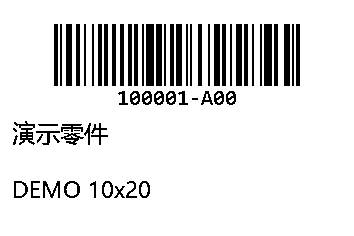

# 飞书多维表格标签打印 · Feishu Label Printer

在飞书多维表格中点击一行按钮，通过联网 Windows 电脑，将该行标签发送到 USB 连接的 Zebra ZPL 打印机。

支持 **物料标签**（Code 128料号条码、料号、名称、规格）和 **样机标签**（Logo、点阵编号、当前记录二维码）。预设版式针对 **ZD888 300 dpi、30×20 mm**；可视化编辑器支持自定义尺寸、页边距、偏移量及字段呈现方式。

## 可视化排版工具 · v0.2

```powershell
.\.venv\Scripts\python.exe -m feishu_label_printer --config config.example.json editor
```

本机浏览器打开 `http://127.0.0.1:8765`。选择字段，添加文字/条码/二维码/Logo，拖动排版，调整字号、标签宽高、四边页边距和打印偏移，并保存、导入或导出模板。预览与实际打印使用同一渲染引擎。

完整说明：[编辑器使用与模板接入](docs/editor.md)。编辑器本身不直接触发打印。

| 物料标签 | 样机标签 |
| --- | --- |
|  |  |

以上为虚构示例。品牌Logo和真实业务数据由使用者在本机配置，未包含在仓库中。

## 使用链路


其他设备无须安装CLI，也不必处于同一局域网。连接打印机的电脑必须开机、用户已登录、不休眠、联网，并运行后台程序。电脑离线时任务保留在飞书，恢复后继续处理。每次点击创建一个任务、打印一张。

## 快速开始

环境：Windows 10/11、Python 3.11+、Node.js/npm、飞书官方 `lark-cli`、已安装的ZPL打印机驱动。

```powershell
git clone https://github.com/jerryhe16/feishu-label-printer.git
cd feishu-label-printer
py -3 -m venv .venv
.\.venv\Scripts\python.exe -m pip install -e ".[test]"
Copy-Item config.example.json config.local.json
```

先生成示例预览；该命令不访问飞书，也不打印：

```powershell
.\.venv\Scripts\python.exe -m feishu_label_printer --config config.example.json preview --profile material --input examples/material.json --output runtime/material.png
.\.venv\Scripts\python.exe -m feishu_label_printer --config config.example.json preview --profile prototype --input examples/prototype.json --output runtime/prototype.png
```

按照[安装与配置](docs/setup.md)完成飞书登录和本机配置，再按[飞书按钮接入](docs/feishu-setup.md)创建打印队列及工作流。确认队列中只包含需要实际打印的任务后启动：

```powershell
.\.venv\Scripts\python.exe -m feishu_label_printer --config config.local.json run
```

`run` 与 `run --once` 都会**实际打印**；预览请使用 `preview`。

## 文档

- [安装、配置、后台启动和迁移](docs/setup.md)
- [可视化排版、保存模板与自定义打印](docs/editor.md)
- [飞书字段、队列、工作流与按钮](docs/feishu-setup.md)
- [操作、状态、校准与故障处理](docs/operations.md)
- [代码结构、故障语义与开发测试](docs/architecture.md)
- [第三方字体与资源](THIRD_PARTY_NOTICES.md)

## 验证范围

项目由已在ZD888上实际打印的物料与样机脚本整理而来。重构版本的自动测试覆盖标签编码、二维码链接、裁切检查和故障恢复；CI在Windows/Linux运行纯逻辑测试，**不会连接飞书或打印机**。在新机器部署时，仍应试打一张并用实际扫码设备验证。

当前限制：单个打印队列只能由一个电脑/程序消费；没有分布式抢占。固定模板使用300 dpi、30×20 mm；自定义模板支持10–200mm、203/300/600dpi，须匹配打印机与纸张。状态“已发送”表示Windows接收了打印任务，不保证纸张已经输出。长料号或过长文字会明确拒绝排版，不自动截断。
